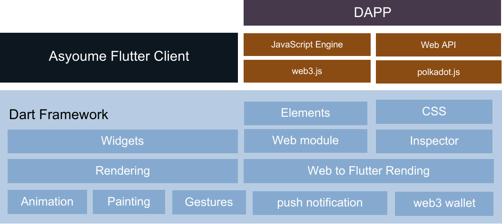
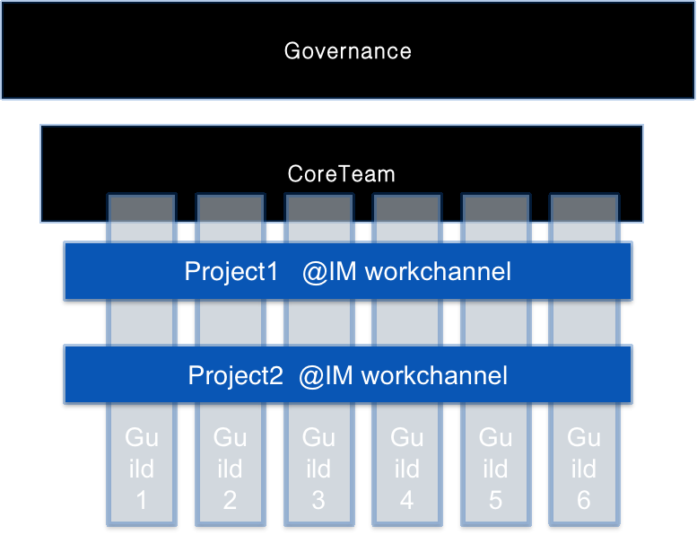

# 我门DAO

  

**我门** 正在创建一个 Web3 原生的、安全的、强大的即时协作工具。
满足DAO所需要基础办公需求，这个工具必须开放、平等、去中心化、公开透明且足够自动化。

## 简介

我门
正致力于为所有的DAO提供去中心化的协同工具，我门基于matrix协议创建了基础的即时沟通工具。在即时通信的基础上，我们通过兼容现有的区块链或提供区块链服务帮助更多的组织或企业快速高效的创建DAO，运营DAO。

第一阶段，我们提供了基于 ink! 的DAO智能合约模板，并同时提供了基于substrate
的pallet模板，方便所有基于substrate的区块链快速集成与使用。可见通过这种非侵入方式兼容现有的DAO,会帮助更多人与企业创建自己的DAO，创建以及运行基于TEE的隐私计算程序。

第二阶段,将帮助企业发行自己的DAO,提供DAO-DAO/企业-DAO的联盟链搭建，并提供基于区块链TEE的分布式隐私计算平台方案。

## 项目详情

我们的长期目标是为生态下的企业/区块链以及web3人员，3步创建安全隐私并且高效率的DAO。成员可以通过我们的工具高效率沟通、共识、生产、结算。

首先 我门 提供的是一个类似与slack并基于 matrix协议
的团队协作工具，该工具为了现代设备而设计，可兼容window/mac/linux/android/ios等设备。

通过基于flutter与web公用渲染引擎的形式，我门客户端能兼容绝大部分DAPP,并能以更快的速度运行，核心业务将由flutter
widgets实现，DAPP将由dapp web engine渲染执行。

  

**我门客户端**
是支持layer1区块链/layer2智能合约的无侵入式客户端，致力于去适配DAO应用场景。作为起始阶段，我门将在完善客户端的同时，将基于substrate并发行使用DAO治理的我门链，逐步创建名为我门DAO的完全自治去中心化组织。通过
**我门DAO**内部需求以及不断引入其他DAO的工作方式,我们将以substrate pallet以及ink!
智能合约方式为波卡生态提供快速搭建DAO的方案。

我门客户端在通讯上有如下特性：

1. 组织内部和组织间无限制的消息传递
2. 公开和非公开频道，项目沟通无障碍
3. 无限制VoIP 聊天
4. 消息端到端加密
5. 区块链治理机器人
6. 多语言SDK可自定义机器人，无限的可扩展性
7. 代码开源无安全隐患，无广告，无收费
8. 通讯为分布式架构，组织拥有自己的组织节点
9. 无缝与DAO治理、DAO公会、DAO项目集成
10. 波卡账户登陆

**我门DAO**致力为DAO提供完善的协同工具软件，首先工具将引导DAO设置一个核心团队，核心团队获得授权对 DAO
的一些日常事务做出决定，这样可以避免无休止的投票。社区授权核心团队管理日常事务。

DAO
组织会根据业务需求，可以设置多个技能组，也称公会（Guild），每个公会将在我门内自动创建公共聊天频道以及看板。用户可以选择加入符合自己特长且愿意为之做贡献的公会。这里面每个人都可以自己决定做什么，不做什么，参与什么项目，不参与什么项目。

  

我门通过substrate pallet以及ink! 智能合约提供DAO模板：

1. RoadMap目标管理
2. DAO share管理
3. 核心团队、公会管理
4. 工作流程管理（board/task）
5. 财政管理
6. 任务赏金管理
7. 热插拔投票管理
8. 贡献值、勋章管理
9. 等级管理

## 贡献

[安装与运行](./docs/install_and_run.md)
