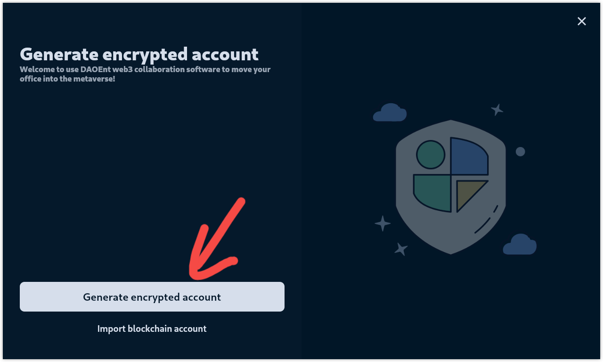
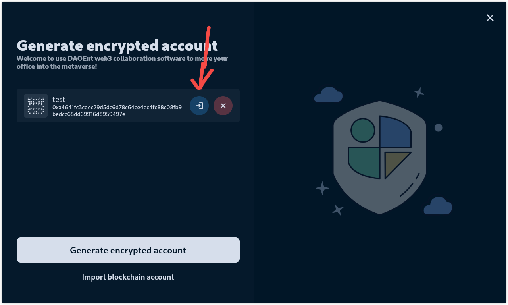
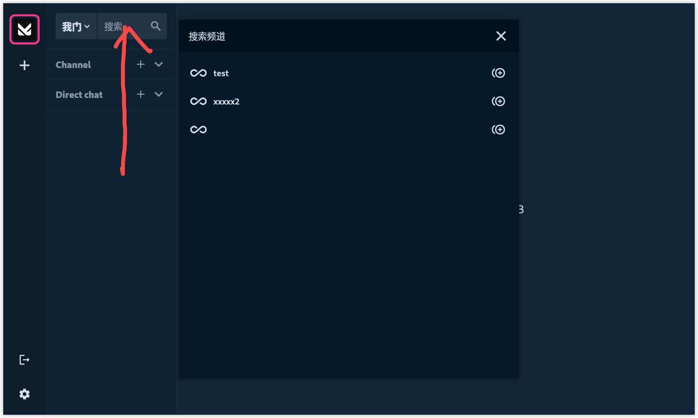
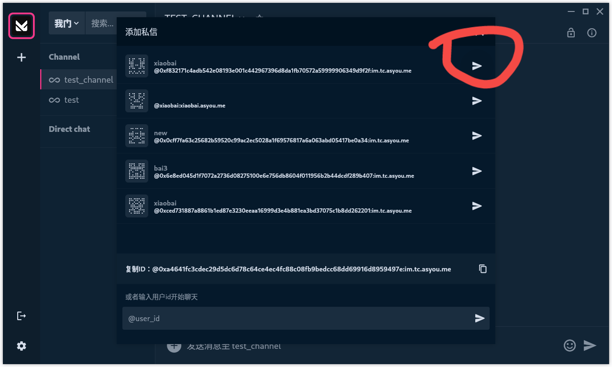

# Dao-entrance Client Testing Guide

## create a account

- Open Client

- Click to create account

- Copy and save mnemonic
- Click Next

- Input nickname
- Input password
- Input password again
- Submit --> account successfully created

## Login to use

- Click login button
- Input password to login

- Select the organization
- Click ok button go to chat

## Join the channel

- Click to view public channels
- Click test to join the channel

- Send test msg to channel

## Start Direct chat

- Click Direct chat add button 
- Select user start a chat

- Send test msg to chat

## join DAO
- Click join button 
- Send join call

## create Project
- Click "Create guild or project" button 
- Send create call

## start Regerendum
- Click "Regerendums" to  Regerendums page
- Click "start" button  to start Regerendum

## join Project
- Click "test" to test Project page
- Click "join" button  to start Regerendum
- Wait for the referendum within the organization to be completed, then you can join the project (The script automatically agrees)

## add Task
- Click "test" to test Project page
- Click "Add Task" button  to start Regerendum

